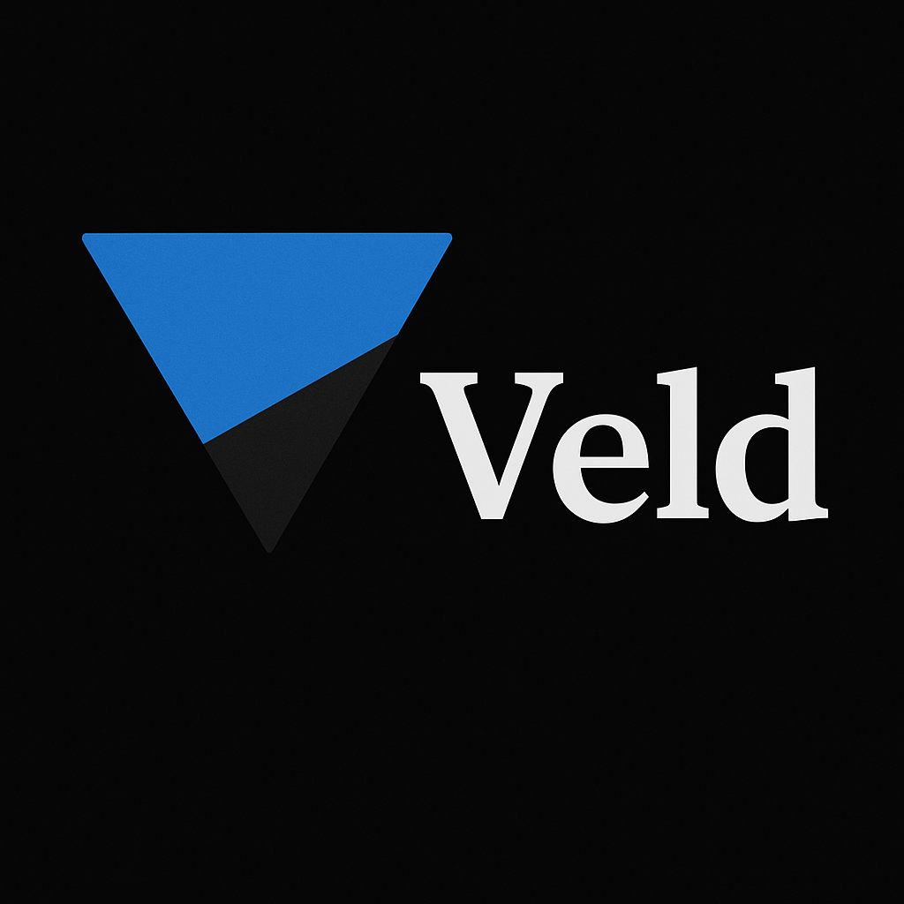

[comment]: <>  (# Veld)

    

## a language full of goodies

Veld is a programming language that aims to provide a rich set of features while maintaining simplicity and ease of use. It is designed to be versatile, supporting various programming paradigms and offering extensive types (with liberal inference), structured behavior, first-class functions, and more.

## Features

- [x] REPL
- [x] Generics
- [x] lambda functions (different types)
- [x] extensive numeric types of different sizes
- [x] first-class functions
- [x] closure functions
- [x] higher-order functions
- [x] type inference
- [x] type casting
- [x] type checking
- [x] type annotations
- [x] modules
- [x] macros
- [x] public keyword ("pub")
- [x] initializer keywords
  - [x] `let`
  - [x] `var`
  - [x] `const`
  - [x] `let mut`
  - [x] `fn`
  - [x] `proc`
- [ ] attributes
- [ ] built-in attributes
  - [ ] `@when`
  - [ ] `@inline`
  <!-- - [ ] `@export` -->
  - [ ] `@test`
  - [ ] `@no_conform`
  - [ ] `@deprecated`
- [ ] built-in modules
  - [ ] `std`
  - [ ] `math`
  - [ ] `io`
  - [ ] `string`
  - [ ] `array`
  - [ ] `fs`
  - [ ] `json`
  - [ ] `collections`
    - [ ] `map`
    - [ ] `set`
  - [ ] `option`
- [ ] transpiler
  - [ ] JavaScript backend
  - [ ] lua backend
  - [ ] beam backend
  - [ ] custom backend
  - [ ] minivm backend
- [ ] Compiler
  - [ ] LLVM backend
